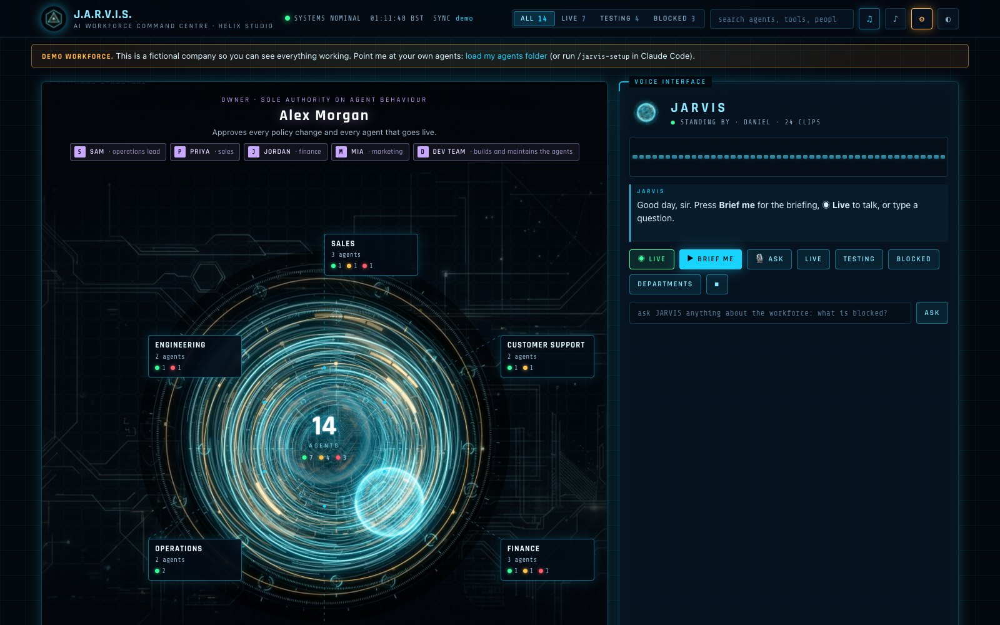
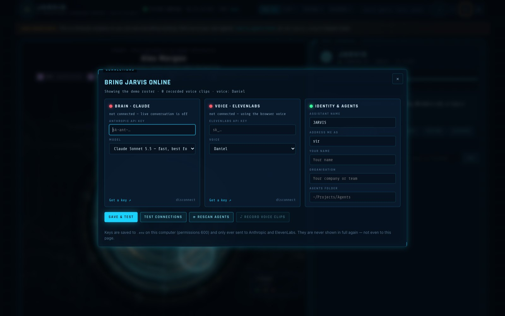
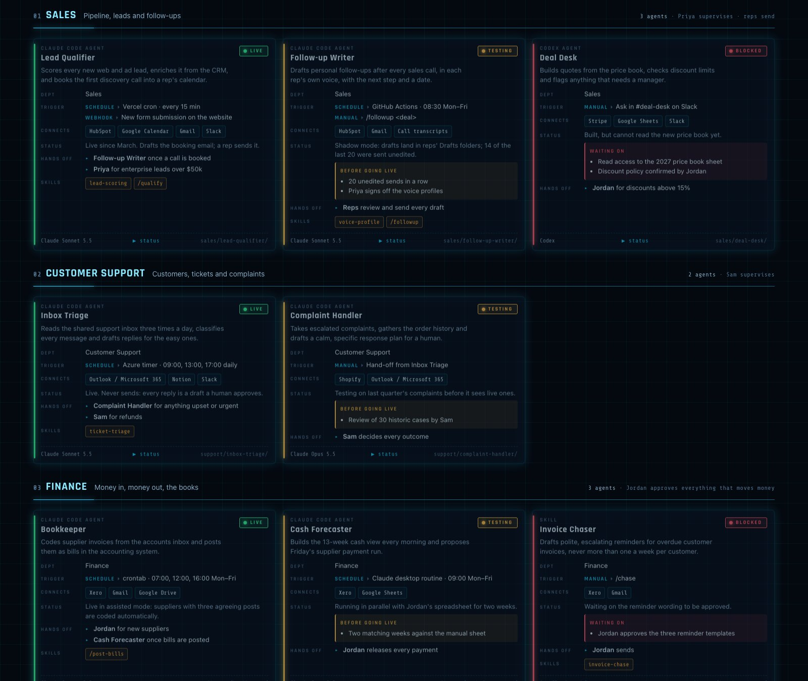

<div align="center">

# J.A.R.V.I.S. Command Centre

**Turn your folder of AI agents into a holographic, voice-controlled command centre.**
Claude is the brain, ElevenLabs is the voice, and it reads your agents folder to build itself.

**[▶ Try the live demo](https://jarvis-command-centre-demo.vercel.app)** · [Quick start](#quick-start) · [Claude Code](#with-claude-code-recommended) · [Connections](#connections-your-keys-your-machine)



<sub>The demo is a fictional company with recorded voice. Live conversation is switched off there because it needs your own Claude key — run it locally to talk to it.</sub>

</div>

---

## What you get

- **An org chart of your AI workforce, generated from your own files.** Point it at the folder where your agents live and it finds Claude Code subagents, slash commands, skills, Codex agents, project `CLAUDE.md` files and every schedule that runs them: Azure timers, Vercel crons, GitHub Actions, crontab, launchd and Claude desktop routines.
- **A live voice assistant that knows the roster.** Press **◉ Live** and just talk. *"What's blocked?"*, *"Who hands off to finance?"*, *"Brief me."* Answers come from Claude (Sonnet 5.5 by default, about a second to the first word) and are spoken by ElevenLabs.
- **The full cinematic HUD.** A boot sequence with an original suit-up intro, a rotating portal with departments in orbit, animated counters, a real-time voice waveform, scanlines, light and dark themes, and UI sounds.
- **One card per agent** showing its job, department, triggers, connections, model, status (Live, Testing or Blocked), what it's waiting on, and who it hands off to.
- **It keeps itself current.** It rescans your folder every 24 hours while it runs, new agents appear, removed ones disappear, and any card you've edited is never overwritten.
- **Easy setup.** A setup wizard, a ⚙ **Connections** panel for your keys, Claude Code slash commands that write rich descriptions for every agent, and one-command publishing to Vercel.

<table>
<tr>
<td width="50%"></td>
<td width="50%"></td>
</tr>
<tr><td align="center"><sub>⚙ Connections: bring your own keys</sub></td><td align="center"><sub>Every agent, grouped by department</sub></td></tr>
</table>

---

## Quick start

You need **Node 20+**. The two API keys are optional to start: the dashboard runs a demo straight away.

```bash
git clone https://github.com/memefactorydev-design/jarvis-command-centre.git
cd jarvis-command-centre
npm install
npm run setup
```

`npm run setup` asks where your agents live, your name, and (optionally) your keys. Then it scans, builds and opens **http://localhost:7777**. Next time, just run `npm start`.

Want to look around first? Run `npm start` and you'll see a fully working demo company with recorded voice. A banner shows you how to load your own agents.

### With Claude Code (recommended)

Open the cloned folder in Claude Code and run:

```
/jarvis-setup
```

Claude installs everything, finds your agents folder, scans it, and then **reads each agent's own files to write a real description**: job, triggers, connections, status, blockers and hand-offs. It starts the dashboard and sends you to the Connections panel to add your keys. It never asks you to paste keys into chat.

| Command | What it does |
|---|---|
| `/jarvis-setup` | First-time setup, end to end |
| `/jarvis-scan` | Rescan and re-describe any new or changed agents |
| `/jarvis-deploy` | Publish to Vercel with an access code |

---

## Connections: your keys, your machine

Click **⚙** in the top bar, or open `http://localhost:7777/?connect=1`.

| Connection | What it powers | Get a key |
|---|---|---|
| **Brain: Claude** (Anthropic API) | Live conversation about your roster | [console.anthropic.com](https://console.anthropic.com/settings/keys) |
| **Voice: ElevenLabs** | Every spoken answer, the recorded briefing and the voice picker | [elevenlabs.io](https://elevenlabs.io/app/settings/api-keys) |

- Each key is **tested before it's saved**. A wrong key is rejected with a clear reason.
- Keys are written to `.env` on your computer (permissions 600) and are **never sent back to the browser**. The panel only ever shows a masked `sk-ant-…a1b2`.
- In the same panel you can pick the model (Sonnet 5.5, Opus 5.5 or Haiku 4.5) and the voice from your ElevenLabs account. You can also rename the assistant, choose how it addresses you (sir, ma'am, boss, your name), set your organisation, change the agents folder, rescan, and record voice clips.
- **No keys yet?** Everything still works except live conversation. Quick answers and the briefing are spoken with your browser's built-in voice.

---

## How it reads your agents

The scanner (`npm run scan`) treats each sub-folder of your agents directory as a unit. It also includes your user-wide `~/.claude/agents`, `~/.claude/skills`, `~/.claude/commands` and Claude desktop routines.

| It finds | From |
|---|---|
| Subagents, with model, tools and MCP servers | `.claude/agents/*.md` frontmatter |
| Slash commands and skills | `.claude/commands/*.md`, any `SKILL.md` |
| Codex agents, Claude Code projects | `AGENTS.md`, `CLAUDE.md`, `README.md` |
| Schedules | `function_app.py` timers, `vercel.json` crons, `.github/workflows`, crontab, launchd, `~/.claude/scheduled-tasks` |
| Connections | MCP server names from `.mcp.json` (never their values), plus 35 known services named in the docs |

**Status rules:** **Live** means it runs on its own schedule or trigger. **Testing** means it's built but runs in shadow mode or on demand. **Blocked** means a named prerequisite isn't met yet, detected from `[YOUR INPUT NEEDED]` markers and status lines.

Cards the scanner writes are marked `"auto": true`. Run `/jarvis-scan` in Claude Code to have Claude rewrite them properly. Any card edited by Claude or by you gets `"auto": false` and is never overwritten. Add people, planned agents and spoken aliases in `data/roster.json` (the schema is in [CLAUDE.md](CLAUDE.md)).

**Privacy by design:** the scanner never opens `.env` files, key files or credential stores. Anything shaped like a key in the text it does read is redacted.

---

## Talking to it

| Do this | It does |
|---|---|
| Press **◉ Live** | Opens the mic. Talk naturally, it answers out loud, then listens again |
| Type in the box | Same, without the mic |
| **▶ Brief me** | The daily briefing: totals, what's live, what's blocked and why |
| **▶ status** on any card | Reads that agent's status |
| Mention an agent by name | Its card flashes and scrolls into view |
| **■** | Stops speaking or listening |

Microphone input uses the browser's speech recognition (Chrome, Edge or Safari). Replies stream from Claude sentence by sentence into ElevenLabs, so it starts talking before it has finished thinking.

### Voice

Daniel, a calm British premade voice, is the default and works on every ElevenLabs account. Change it in Connections, or:

```bash
npm run voice -- --list          # voices on your account
npm run voice -- --use <voiceId> # switch
npm run voice -- --design        # design an original calm AI-butler voice
npm run voice                    # record the briefing + answers (only changed clips are re-recorded)
```

---

## Publish it

```bash
npm i -g vercel && vercel login   # once
npm run deploy
```

This builds the page and uploads your keys from `.env` as **encrypted** Vercel environment variables. It also creates an access code that gates the paid live endpoints, deploys to production, and prints your URL. To unlock live voice on any device, open `https://<your-site>.vercel.app/#code=<JARVIS_ACCESS_CODE from .env>`. Anyone without the code still sees the dashboard and hears the recorded briefing. Use `npm run deploy -- --no-env` for a keyless showcase.

Deploys are staged in `~/.jarvis-command-centre/deploy/<project>/` — outside your repo, so Vercel never connects to your Git remote and a `git push` never triggers a build of the raw source.

---

## Configure

`jarvis.config.json` is created by setup and can be edited anytime. Most of it is also in the Connections panel.

| Key | Default | Meaning |
|---|---|---|
| `assistantName` | `JARVIS` | What it's called, in the header and in speech |
| `honorific` | `sir` | How it addresses you |
| `orgName`, `owner` | — | Your organisation and the owner node at the top of the org chart |
| `agentsDir` | — | The folder to scan; `extraDirs` adds more |
| `includeUserAgents`, `includeScheduledTasks` | `true` | Also scan `~/.claude` agents, skills, commands and desktop routines |
| `model` | `claude-sonnet-5-5` | `claude-opus-5-5` gives deeper answers, `claude-haiku-4-5` is cheapest |
| `voiceId`, `ttsModel` | Daniel, `eleven_flash_v2_5` | ElevenLabs voice and speech model |
| `port`, `autoRescanHours` | `7777`, `24` | Local server port and rescan interval |
| `tagline` | — | A line under the legend, such as *"Every agent drafts; humans send."* |

Run `npm run doctor` any time to check Node, keys, folder, clips, port and Vercel, with the fix for anything missing.

## Costs

- **Claude:** the roster is sent once, then served from Anthropic's prompt cache, so a typical spoken question costs well under one US cent on Sonnet 5.5.
- **ElevenLabs:** recording the clips for a 25-agent roster uses about 5,000 characters. Live replies use about 200 characters each.
- **Hosting:** free locally. A personal Vercel project usually fits the Hobby tier.

## Make it yours

The look lives in `web/template.html` (plain HTML, CSS and JS, no framework). The artwork, portal animation and intro music are in `web/assets/`. Regenerate them with your own prompts using the optional [studio tools](tools/README.md) (Google Gemini image models, the ElevenLabs Music API and ffmpeg). Add `?intro=b` or `?intro=c` to the URL to audition the alternate intros.

## Troubleshooting

| Symptom | Fix |
|---|---|
| "Live link offline" | Connect Claude in ⚙ Connections (local), or redeploy after adding the key (hosted) |
| No microphone button | Use Chrome, Edge or Safari, or type instead |
| Opened `index.html` directly and live mode is off | Live mode needs the local server: `npm start` |
| Port busy | `npm start -- --port 8080` |
| An agent is in the wrong department or has a thin description | `/jarvis-scan` in Claude Code, or edit `data/roster.json`, then `npm run build` |

## Project layout

```
bin/            setup · scan · build · serve · voice · deploy · doctor
api/            jarvis.js (Claude) · tts.js (ElevenLabs): run locally and on Vercel unchanged
web/            template.html + assets (art, portal video, sound effects, intro)
data/           example-roster.json (demo) · demo-voice/ · your roster.json (git-ignored)
.claude/        /jarvis-setup · /jarvis-scan · /jarvis-deploy
tools/          optional artwork and intro generators
```

## Credits

Built with [Claude](https://www.anthropic.com/claude) (Anthropic) for reasoning and [ElevenLabs](https://elevenlabs.io) for voice, music and sound effects. The artwork was generated with Google's Gemini image models. The demo company, its people and agents are fictional. The intro music and every voice are original synthetic creations, not clips of any film, actor or existing score.

*An unofficial, fan-styled project. "J.A.R.V.I.S." styling is an homage; this project is not affiliated with or endorsed by Marvel, Disney or any film studio.*

## License

[MIT](LICENSE)
